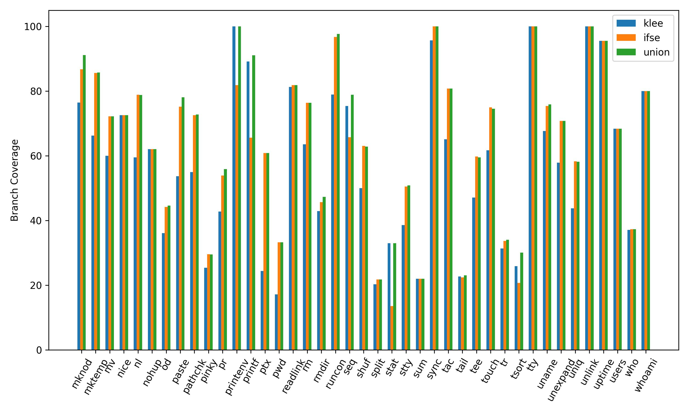
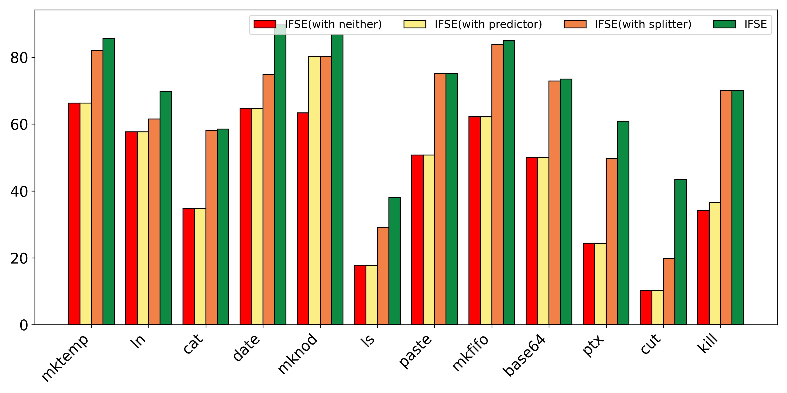

## Tool Evaluation
We evaluated IFSE on 79 programs in CoreUtils, a widely used open-source core tool program collection in Unix-like operating system, to demonstrate IFSE's effectiveness when facing real-world applications. 

We compared IFSE with its baseline KLEE with `4` hours timeout and `8` seconds fuzz solver timeout.

Due to limited space in the paper, we only presented the overall situation of the experiment and list some supplementary details including:

- `Line Coverage`: Compared to KLEE, how is the situation of IFSE covering the number of lines of program?

- `Branch Coverage`：Compared to KLEE, how is the situation of IFSE covering the branches of program?

- `Optimization strategies`: What is the impact of the main optimizations adopted by IFSE on its performance?

### Line Coverage

Line Coverage Comparison of IFSE and KLEE:

- Average Line Coverage:

  - IFSE: **54.8%**

  - KLEE: **42.7%**

  - Relative Improvement: Ranging from **0.7%** (readlink) to **357.9%** (cut) across **63** programs

- the **Union** represents the coverage achieved by all test cases generated by IFSE and KLEE, indicating that **the majority of new program paths are indeed explored by IFSE rather than KLEE**.

#### Result Overview

#### Details

|     &nbsp; &nbsp; &nbsp; &nbsp;   #    &nbsp; &nbsp; &nbsp; &nbsp;   |  &nbsp; &nbsp; &nbsp; &nbsp; Program  &nbsp; &nbsp; &nbsp; &nbsp;  |  &nbsp; &nbsp; &nbsp; &nbsp;  KLEE   &nbsp; &nbsp; &nbsp; &nbsp;  |   &nbsp; &nbsp; &nbsp; &nbsp;  IFSE   &nbsp; &nbsp; &nbsp; &nbsp;  |   &nbsp; &nbsp; &nbsp; &nbsp; Union &nbsp; &nbsp; &nbsp; &nbsp;  |  &nbsp; &nbsp; &nbsp; &nbsp; Improvement  &nbsp; &nbsp; &nbsp; &nbsp; |
| :---------: | :------: | :------: | :------: | :------: | :---------: |
|      1      |  base64  |   49.2   |   72.5   |   72.8   |    47.4     |
|      2      | basename |   64.1   |   81.9   |   81.6   |    27.8     |
|      3      |   cat    |   27.9   |   58.8   |   58.7   |    110.8    |
|      4      |  chcon   |   27.8   |   43.3   |   43.3   |    55.8     |
|      5      |  chgrp   |   40.6   |   65.2   |   65.4   |    60.6     |
|      6      |  chmod   |   32.7   |   44.9   |   44.9   |    37.3     |
|      7      |  chown   |   34.6   |   58.5   |   58.5   |    69.1     |
|      8      |  chroot  |   36.5   |   36.5   |   36.5   |     0.0     |
|      9      |   comm   |   50.5   |   56.7   |   58.4   |    12.3     |
|     10      |    cp    |   26.1   |   35.8   |   35.8   |    37.2     |
|     11      |  csplit  |   60.2   |   64.9   |    68    |     7.8     |
|     12      |   cut    |   9.5    |   43.5   |   43.6   |    357.9    |
|     13      |   date   |   38.8   |   63.9   |   64.5   |    64.7     |
|     14      |    dd    |   35.4   |   36.6   |   36.5   |     3.4     |
|     15      |    df    |   43.9   |   57.4   |   57.2   |    30.8     |
|     16      | dirname  |   66.7   |   76.9   |   76.9   |    15.3     |
|     17      |    du    |   44.7   |   61.6   |   61.4   |    37.8     |
|     18      |   echo   |   85.8   |   100    |   100    |    16.6     |
|     19      |   env    |    16    |   22.8   |    22    |    42.5     |
|     20      |  expand  |   49.3   |   66.9   |    67    |    35.7     |
|     21      |   expr   |   25.9   |   44.3   |   44.2   |    71.0     |
|     22      |  factor  |   22.3   |   23.8   |   23.8   |     6.7     |
|     23      |  false   |   44.4   |   44.4   |   44.4   |     0.0     |
|     24      |   fmt    |   57.8   |    67    |   68.4   |    15.9     |
|     25      |   fold   |    50    |   61.4   |   62.1   |    22.8     |
|     26      | ginstall |   33.5   |   46.7   |   46.6   |    39.4     |
|     27      |   head   |   31.7   |   36.3   |   36.4   |    14.5     |
|     28      |  hostid  |    80    |    80    |    80    |     0.0     |
|     29      |    id    |   54.4   |   65.9   |   65.3   |    21.1     |
|     30      |   join   |   27.6   |   31.2   |   38.2   |    13.0     |
|     31      |   kill   |   29.1   |    62    |   60.5   |    113.1    |
|     32      |   link   |    75    |    75    |    75    |     0.0     |
|     33      |    ln    |   39.5   |   62.5   |   62.8   |    58.2     |
|     34      | logname  |   63.6   |   63.6   |   63.6   |     0.0     |
|     35      |    ls    |   18.2   |    30    |   30.6   |    64.8     |
|     36      |  md5sum  |   23.8   |   39.3   |   39.5   |    65.1     |
|     37      |  mkdir   |   35.2   |   61.1   |   61.4   |    73.6     |
|     38      |  mkfifo  |   43.8   |   65.6   |   65.6   |    49.8     |
|     39      |  mknod   |   58.8   |   71.2   |   73.7   |    21.1     |
|     40      |  mktemp  |   49.3   |   75.3   |   75.5   |    52.7     |
|     41      |    mv    |   49.8   |   66.2   |   66.2   |    32.9     |
|     42      |   nice   |   70.4   |   74.7   |   74.7   |     6.1     |
|     43      |    nl    |   35.4   |   61.8   |   61.9   |    74.6     |
|     44      |  nohup   |   59.7   |   59.7   |   59.7   |     0.0     |
|     45      |    od    |   27.7   |   37.2   |   37.4   |    34.3     |
|     46      |  paste   |   43.5   |   76.6   |   79.1   |    76.1     |
|     47      | pathchk  |   37.3   |   56.1   |   56.5   |    50.4     |
|     48      |  pinky   |   16.6   |   30.3   |   30.2   |    82.5     |
|     49      |    pr    |   34.7   |   48.7   |   50.3   |    40.3     |
|     50      | printenv |   75.6   |   72.9   |   81.5   |    -3.6     |
|     51      |  printf  |   75.5   |   65.5   |   83.8   |    -13.2    |
|     52      |   ptx    |   20.4   |   64.7   |   64.6   |    217.2    |
|     53      |   pwd    |   15.3   |   26.4   |   26.4   |    72.5     |
|     54      | readlink |   40.6   |   40.9   |    41    |     0.7     |
|     55      |    rm    |   33.6   |   56.9   |    57    |    69.3     |
|     56      |  rmdir   |   34.3   |   46.5   |   47.4   |    35.6     |
|     57      |  runcon  |   47.2   |   71.3   |   72.1   |    51.1     |
|     58      |   seq    |   60.3   |   54.6   |   65.1   |    -9.5     |
|     59      |   shuf   |   34.6   |   51.5   |   51.7   |    48.8     |
|     60      |  split   |   17.1   |   18.8   |   18.8   |     9.9     |
|     61      |   stat   |   26.9   |   11.5   |   26.9   |    -57.2    |
|     62      |   stty   |   30.2   |   40.6   |   40.9   |    34.4     |
|     63      |   sum    |   21.3   |   23.3   |   23.3   |     9.4     |
|     64      |   sync   |   60.7   |   77.4   |   77.4   |    27.5     |
|     65      |   tac    |   50.5   |   65.8   |   65.8   |    30.3     |
|     66      |   tail   |   20.1   |   19.5   |   20.7   |    -3.0     |
|     67      |   tee    |   42.6   |   52.9   |   52.8   |    24.2     |
|     68      |  touch   |    40    |   64.7   |   64.1   |    61.8     |
|     69      |    tr    |   24.9   |   28.4   |    29    |    14.1     |
|     70      |  tsort   |   24.9   |   21.4   |    29    |    -14.1    |
|     71      |   tty    |   70.3   |   81.1   |   81.1   |    15.4     |
|     72      |  uname   |   44.2   |   77.8   |   78.1   |    76.0     |
|     73      | unexpand |   43.1   |   57.4   |   57.3   |    33.2     |
|     74      |   uniq   |   39.4   |   61.3   |   61.4   |    55.6     |
|     75      |  unlink  |   77.3   |   77.3   |   77.3   |     0.0     |
|     76      |  uptime  |    73    |    73    |    73    |     0.0     |
|     77      |  users   |   59.3   |   59.3   |   59.3   |     0.0     |
|     78      |   who    |   16.3   |   27.3   |    27    |    67.5     |
|     79      |  whoami  |    76    |    76    |    76    |     0.0     |
| **Average** |  **-**   | **42.7** | **54.8** | **55.9** |  **28.3**   |

### Branch Coverage

As for branch coverage, IFSE achieves a higher average line coverage for most of the programs (51 programs) ranging from relative TODO\% to TODO\% over KLEE and achieves an average line coverage of 64.2\% (while KLEE averaged 57.7\%), which demonstrates the branch exploration ability of IFSE, the details are as follows:

Branch Coverage Comparison of IFSE and KLEE:

- Average Branch Coverage:

  - IFSE: **64.2%**

  - KLEE: **57.2%**
  
  - Relative Improvement: Ranging from **0.5%** (who) to **325.5%** (cut) across **51** programs

#### Result Overview

#### Details
 
|       &nbsp; &nbsp; &nbsp; &nbsp;  #  &nbsp; &nbsp; &nbsp; &nbsp; |    &nbsp; &nbsp; &nbsp; &nbsp; Program  &nbsp; &nbsp; &nbsp; &nbsp;  |   &nbsp; &nbsp; &nbsp; &nbsp; KLEE  &nbsp; &nbsp; &nbsp; &nbsp;    |    &nbsp; &nbsp; &nbsp; &nbsp; IFSE  &nbsp; &nbsp; &nbsp; &nbsp;   |   &nbsp; &nbsp; &nbsp; &nbsp; Union  &nbsp; &nbsp; &nbsp; &nbsp;   |    &nbsp; &nbsp; &nbsp; &nbsp; Improvement  &nbsp; &nbsp; &nbsp; &nbsp; |
| :---------: | :------: | :------: | :------: | :------: | :---------: |
|      1      |  base64  |    50    |   73.5   |   74.1   |    47.0     |
|      2      | basename |   88.9   |   98.9   |   98.8   |    11.2     |
|      3      |   cat    |   36.8   |   58.5   |   58.6   |    59.0     |
|      4      |  chcon   |   42.9   |   44.6   |   44.8   |     4.0     |
|      5      |  chgrp   |   80.4   |   88.2   |   89.1   |     9.7     |
|      6      |  chmod   |   49.6   |   53.6   |   53.7   |     8.1     |
|      7      |  chown   |   70.4   |   77.8   |   77.4   |    10.5     |
|      8      |  chroot  |   42.3   |   42.3   |   42.3   |     0.0     |
|      9      |   comm   |    74    |   73.5   |   75.8   |    -0.7     |
|     10      |    cp    |   37.6   |   42.2   |   42.3   |    12.2     |
|     11      |  csplit  |   67.4   |   69.6   |   74.1   |     3.3     |
|     12      |   cut    |   10.2   |   43.4   |   43.4   |    325.5    |
|     13      |   date   |   64.7   |   89.7   |   90.3   |    38.6     |
|     14      |    dd    |   37.4   |   39.2   |   39.1   |     4.8     |
|     15      |    df    |   51.2   |    62    |   61.9   |    21.1     |
|     16      | dirname  |   100    |   100    |   100    |     0.0     |
|     17      |    du    |   64.2   |   71.7   |   71.4   |    11.7     |
|     18      |   echo   |   93.4   |   95.6   |   95.6   |     2.4     |
|     19      |   env    |    24    |    27    |   26.7   |    12.5     |
|     20      |  expand  |   73.9   |    80    |   80.2   |     8.3     |
|     21      |   expr   |   28.7   |   38.4   |   38.2   |    33.8     |
|     22      |  factor  |   21.3   |   22.6   |   22.5   |     6.1     |
|     23      |  false   |   100    |   100    |   100    |     0.0     |
|     24      |   fmt    |   62.5   |    66    |   67.6   |     5.6     |
|     25      |   fold   |   73.1   |   76.1   |   76.1   |     4.1     |
|     26      | ginstall |   34.5   |   43.3   |   43.1   |    25.5     |
|     27      |   head   |   35.3   |   36.6   |   36.6   |     3.7     |
|     28      |  hostid  |   100    |   100    |   100    |     0.0     |
|     29      |    id    |    74    |   76.6   |   76.3   |     3.5     |
|     30      |   join   |    29    |   30.4   |    41    |     4.8     |
|     31      |   kill   |   36.6   |    70    |   70.2   |    91.3     |
|     32      |   link   |   100    |   100    |   100    |     0.0     |
|     33      |    ln    |   55.8   |   69.8   |   70.3   |    25.1     |
|     34      | logname  |   100    |   100    |   100    |     0.0     |
|     35      |    ls    |   29.1   |    38    |   39.2   |    30.6     |
|     36      |  md5sum  |   28.9   |   40.9   |    41    |    41.5     |
|     37      |  mkdir   |   42.9   |   59.4   |   59.8   |    38.5     |
|     38      |  mkfifo  |   62.2   |   84.9   |   84.4   |    36.5     |
|     39      |  mknod   |   76.5   |   86.8   |   91.2   |    13.5     |
|     40      |  mktemp  |   66.3   |   85.6   |   85.8   |    29.1     |
|     41      |    mv    |    60    |   72.2   |   72.2   |    20.3     |
|     42      |   nice   |   72.6   |   72.6   |   72.6   |     0.0     |
|     43      |    nl    |   59.5   |   78.9   |   78.8   |    32.6     |
|     44      |  nohup   |   62.1   |   62.1   |   62.1   |     0.0     |
|     45      |    od    |   36.1   |   44.2   |   44.6   |    22.4     |
|     46      |  paste   |   53.7   |   75.2   |   78.1   |    40.0     |
|     47      | pathchk  |    55    |   72.6   |   72.8   |    32.0     |
|     48      |  pinky   |   25.4   |   29.6   |   29.5   |    16.5     |
|     49      |    pr    |   42.8   |   53.9   |   55.9   |    25.9     |
|     50      | printenv |   100    |   81.9   |   100    |    -18.1    |
|     51      |  printf  |   89.2   |   65.6   |   91.1   |    -26.5    |
|     52      |   ptx    |   24.4   |   60.9   |   60.9   |    149.6    |
|     53      |   pwd    |   17.2   |   33.3   |   33.3   |    93.6     |
|     54      | readlink |   81.3   |   81.9   |   81.9   |     0.7     |
|     55      |    rm    |   63.6   |   76.4   |   76.4   |    20.1     |
|     56      |  rmdir   |   42.9   |   45.7   |   47.3   |     6.5     |
|     57      |  runcon  |    79    |   96.8   |   97.7   |    22.5     |
|     58      |   seq    |   75.4   |   65.8   |   78.9   |    -12.7    |
|     59      |   shuf   |    50    |   63.1   |   62.9   |    26.2     |
|     60      |  split   |   20.3   |   21.8   |   21.8   |     7.4     |
|     61      |   stat   |    33    |   13.6   |    33    |    -58.8    |
|     62      |   stty   |   38.6   |   50.5   |   50.9   |    30.8     |
|     63      |   sum    |    22    |    22    |    22    |     0.0     |
|     64      |   sync   |   95.7   |   100    |   100    |     4.5     |
|     65      |   tac    |   65.1   |   80.8   |   80.8   |    24.1     |
|     66      |   tail   |   22.7   |   22.4   |   23.1   |    -1.3     |
|     67      |   tee    |   47.1   |   59.8   |   59.5   |    27.0     |
|     68      |  touch   |   61.7   |    75    |   74.6   |    21.6     |
|     69      |    tr    |   31.4   |   33.7   |   34.1   |     7.3     |
|     70      |  tsort   |   25.9   |   20.7   |   30.1   |    -20.1    |
|     71      |   tty    |   100    |   100    |   100    |     0.0     |
|     72      |  uname   |   67.7   |   75.4   |   75.9   |    11.4     |
|     73      | unexpand |   57.9   |   70.8   |   70.8   |    22.3     |
|     74      |   uniq   |   43.8   |   58.3   |   58.2   |    33.1     |
|     75      |  unlink  |   100    |   100    |   100    |     0.0     |
|     76      |  uptime  |   95.6   |   95.6   |   95.6   |     0.0     |
|     77      |  users   |   68.4   |   68.4   |   68.4   |     0.0     |
|     78      |   who    |   37.1   |   37.3   |   37.3   |     0.5     |
|     79      |  whoami  |    80    |    80    |    80    |     0.0     |
| **Average** |  **-**   | **57.2** | **64.2** | **65.8** |  **12.2**   |

### Optimization Strategies

As an open-source tool, **IFSE** employs various optimization strategies to enhance its usability. Among these strategies, the **splitter** and **predictor** hold relatively significant importance:

- **Splitter**: This component focuses on identifying constraints that are likely to be unsolvable, allowing it to immediately return results and thereby reduce unnecessary solving.
- **Predictor**: This component aims to remove parts of the constraints that do not affect the solving result, thus reducing the search space for solving.

#### Ablation Experiments

To study their impact on the performance of IFSE, we conducted ablation experiments with four configurations:

1. **IFSE with neither**
2. **IFSE with predictor**
3. **IFSE with splitter**
4. **IFSE with both**

#### Line Coverage

In evaluating 79 CoreUtils programs, the results show:

- The **splitter** improves the average branch coverage by **37.3%**.
- The **predictor** improves the average branch coverage by **2.9%**.
- Using both together enhances the coverage by **43.8%**, indicating that the two optimizations are complementary. The **predictor** may assess the satisfiability of large constraints **more accurately** when these constraints are scaled down first by the **splitter**.

The following figure shows the branch coverage of 12 programs in CoreUtils with the largest coverage improvement under different configurations. Other programs show a similar trend.

#### Branch Coverage

In evaluating 79 CoreUtils programs, the results show:

- The **splitter** improves the average branch coverage by **21.7%**.
- The **predictor** improves the average branch coverage by **2.2%**.
- Using both together enhances the coverage by **25.6%**.

The following figure shows the branch coverage of 12 programs in CoreUtils with the largest coverage improvement under different configurations. Other programs show a similar trend.

