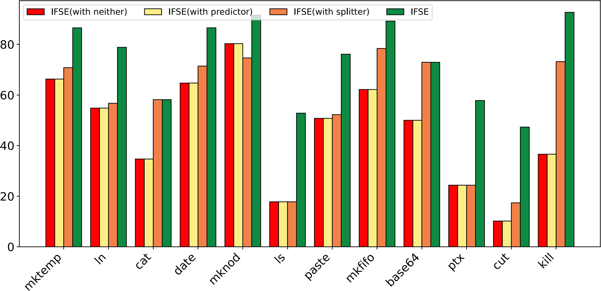

# IFSE

## OverView

IFSE (**I**ntegrating **F**uzz Solving with **S**ymbolic **E**xecution) is an open-souce tool that incorporates various existing techniques to integrate fuzz solving with symbolic execution. As far as we know, IFSE is **the first open-source** SE tool which integrates fuzz solving to address the challenges arised by External Functions(EFs) in real-world applications.


## Tool Setup

We have packaged all the resources related to IFSE into Docker, including the source code of IFSE and the relevant resources required for reproducing the experiments. 

You can setup IFSE under the following instructions:

### 1. Install Docker

Docker provides tools for deploying applications within containers. Containers are (mostly) isolated from each other and the underlying system. This allows you to make a container, tinker with it and then throw it away when you’re done without affecting the underlying system or other containers.

A Docker container is built from a Docker image. A Docker image encapsulates an application, which in this case is KLEE. This application-level encapsulation is useful because it provides a “portable” and reproducible environment in which to run IFSE.

Follow these links for installation instructions on [Ubuntu](https://docs.docker.com/engine/install/ubuntu/), [OS X](https://docs.docker.com/desktop/install/mac-install/) and [Windows](https://docs.docker.com/desktop/install/windows-install/).

### 2. Pull docker image

We have packaged and pushed the docker image of IFSE to DockerHub, you can pull the docker image by following instruction:

```sh
docker pull achilles0425/ifse-image:stable
```

 This command builds a Docker image named `ifse-image`, which contains the complete runtime environment, source code and evaluation scripts. 

If the image is pulled successfully, you can use the following command to have a check. You should find that an image named `ifse-image` exists.

```
$ docker images
REPOSITORY                                     TAG       IMAGE ID       CREATED         SIZE
achilles0425/ifse-image                        stable    a78bcd0cfa67   2 months ago    11.3GB
```

### 3. Run docker image

To run the image, use the following command:

```sh
docker run -it ifse-image:stable
```

### 

## Tool environment

After starting the docker container, the following items can be found in your environment:

- `Coreutils-test` is the experiment directory, which contains:

  - `coreutils-9.4-bc`: All compiled byte code files of programs in CoreUtils-9.4 and  all scripts for reproducing evaluation.

  - `Coreutils-9.4-src`: Source code of all programs in CoreUtils-9.4.

  - `README.md`: Guide on how to reproduce our experiment.

- `Ifse` contains all source code and executable artifacts of our tool, including:

  - `build`: Compiled binary code of IFSE.

  - `klee`: The symbolic execution engine part in which we have extended over 4600 lines of C++ code.

  - `krpk`: A highly modularized fuzz solver that contains over 11000 lines of Rust code and can easily support complex theories like floating-point theory and different backend fuzzers.

  - `README.md`: Guide on how to recompile IFSE after modifying its source code.


## Experiment Detail

We evaluated IFSE on 79 programs in CoreUtils, a widely used open-source core tool program collection in Unix-like operating system, to demonstrate IFSE's effectiveness when facing real-world applications. 

We compared IFSE with its baseline KLEE with `4` hours timeout and `8` seconds fuzz solver timeout.

Due to limited space in the paper, we only presented the overall situation of the experiment and list some supplementary details including:

- `Line Coverage`: Compared to KLEE, how is the situation of IFSE covering the number of lines of program?

- `Branch Coverage`：Compared to KLEE, how is the situation of IFSE covering the branches of program?

- `Optimizations`: What is the impact of the main optimizations adopted by IFSE on its performance?


### Line Coverage

IFSE achieves a higher average line coverage for most of the programs (63 programs) ranging from relative 0.8\% to 217.2\% over KLEE and achieves an average line coverage of 54.8\% (while KLEE averaged 42.7\%), which demonstrates the path exploration ability of IFSE. Meanwhile, IFSE achieves relative higher branch coverage of 12.3\% over KLEE. The coverage details of all programs are as follows:

| # |program |klee |ifse  |union |improvement (%)|
|:---:|:--------:|:-----:|:------:|:------:|:-----------:|
|1  |base64  |49.2 |72.5  |72.8  |47.6       |
|2  |basename|64.1 |81.9  |81.6  |27.8       |
|3  |cat     |27.9 |58.8  |58.7  |110.5      |
|4  |chcon   |27.8 |43.3  |43.3  |55.9       |
|5  |chgrp   |40.6 |65.2  |65.4  |60.7       |
|6  |chmod   |32.7 |44.9  |44.9  |37.3       |
|7  |chown   |34.6 |58.5  |58.5  |69.4       |
|8  |chroot  |36.5 |36.5  |36.5  |0.0        |
|9  |comm    |50.5 |56.7  |58.4  |12.4       |
|10 |cp      |26.1 |35.8  |35.8  |37.3       |
|11 |csplit  |60.2 |64.9  |68.0  |7.9        |
|12 |cut     |9.5  |43.5  |43.6  |358.2      |
|13 |date    |38.8 |63.9  |64.5  |64.7       |
|14 |dd      |35.4 |36.6  |36.5  |3.4        |
|15 |df      |43.9 |57.4  |57.2  |31.0       |
|16 |dirname |66.7 |76.9  |76.9  |15.4       |
|17 |du      |44.7 |61.6  |61.4  |37.7       |
|18 |echo    |85.8 |100.0 |100.0 |16.5       |
|19 |env     |16.0 |22.8  |22.0  |42.7       |
|20 |expand  |49.3 |66.9  |67.0  |35.7       |
|21 |expr    |25.9 |44.3  |44.2  |70.8       |
|22 |factor  |22.3 |23.8  |23.8  |7.1        |
|23 |FALSE   |44.4 |44.4  |44.4  |0.0        |
|24 |fmt     |57.8 |67.0  |68.4  |16.0       |
|25 |fold    |50.0 |61.4  |62.1  |22.9       |
|26 |ginstall|33.5 |46.7  |46.6  |39.3       |
|27 |head    |31.7 |36.3  |36.4  |14.7       |
|28 |hostid  |80.0 |80.0  |80.0  |0.0        |
|29 |id      |54.4 |65.9  |65.3  |21.3       |
|30 |join    |27.6 |31.2  |38.2  |13.1       |
|31 |kill    |29.1 |62.0  |60.5  |113.1      |
|32 |link    |75.0 |75.0  |75.0  |0.0        |
|33 |ln      |39.5 |62.5  |62.8  |58.2       |
|34 |logname |63.6 |63.6  |63.6  |0.0        |
|35 |ls      |18.2 |30.0  |30.6  |64.8       |
|36 |md5sum  |23.8 |39.3  |39.5  |65.1       |
|37 |mkdir   |35.2 |61.1  |61.4  |73.5       |
|38 |mkfifo  |43.8 |65.6  |65.6  |50.0       |
|39 |mknod   |58.8 |71.2  |73.7  |21.1       |
|40 |mktemp  |49.3 |75.3  |75.5  |52.9       |
|41 |mv      |49.8 |66.2  |66.2  |33.1       |
|42 |nice    |70.4 |74.7  |74.7  |6.0        |
|43 |nl      |35.4 |61.8  |61.9  |74.7       |
|44 |nohup   |59.7 |59.7  |59.7  |0.0        |
|45 |od      |27.7 |37.2  |37.4  |34.1       |
|46 |paste   |43.5 |76.6  |79.1  |76.1       |
|47 |pathchk |37.3 |56.1  |56.5  |50.4       |
|48 |pinky   |16.6 |30.3  |30.2  |82.4       |
|49 |pr      |34.7 |48.7  |50.3  |40.4       |
|50 |printenv|75.6 |72.9  |81.5  |-3.5       |
|51 |printf  |75.5 |65.5  |83.8  |-13.2      |
|52 |ptx     |20.4 |64.7  |64.6  |217.2      |
|53 |pwd     |15.3 |26.4  |26.4  |72.7       |
|54 |readlink|40.6 |40.9  |41.0  |0.8        |
|55 |rm      |33.6 |56.9  |57.0  |69.5       |
|56 |rmdir   |34.3 |46.5  |47.4  |35.3       |
|57 |runcon  |47.2 |71.3  |72.1  |50.9       |
|58 |seq     |60.3 |54.6  |65.1  |-9.5       |
|59 |shuf    |34.6 |51.5  |51.7  |49.0       |
|60 |split   |17.1 |18.8  |18.8  |9.8        |
|61 |stat    |26.9 |11.5  |26.9  |-57.3      |
|62 |stty    |30.2 |40.6  |40.9  |34.5       |
|63 |sum     |21.3 |23.3  |23.3  |9.0        |
|64 |sync    |60.7 |77.4  |77.4  |27.5       |
|65 |tac     |50.5 |65.8  |65.8  |30.4       |
|66 |tail    |20.1 |19.5  |20.7  |-2.7       |
|67 |tee     |42.6 |52.9  |52.8  |24.0       |
|68 |touch   |40.0 |64.7  |64.1  |61.8       |
|69 |tr      |24.9 |28.4  |29.0  |13.9       |
|70 |tsort   |24.9 |21.4  |29.0  |-14.0      |
|71 |tty     |70.3 |81.1  |81.1  |15.4       |
|72 |uname   |44.2 |77.8  |78.1  |75.9       |
|73 |unexpand|43.1 |57.4  |57.3  |33.2       |
|74 |uniq    |39.4 |61.3  |61.4  |55.7       |
|75 |unlink  |77.3 |77.3  |77.3  |0.0        |
|76 |uptime  |73.0 |73.0  |73.0  |0.0        |
|77 |users   |59.3 |59.3  |59.3  |0.0        |
|78 |who     |16.3 |27.3  |27.0  |67.9       |
|79 |whoami  |76.0 |76.0  |76.0  |0.0        |


### Branch Coverage

As for branch coverage, IFSE achieves a higher average line coverage for most of the programs (51 programs) ranging from relative TODO\% to TODO\% over KLEE and achieves an average line coverage of 64.2\% (while KLEE averaged 57.7\%), which demonstrates the branch exploration ability of IFSE, the details are as follows:

| # |o       |klee  |ifse  |union |improvement (%)|
|:---:|:--------:|:------:|:------:|:------:|:-----------:|
|1  |base64  |50.0  |73.5  |74.1  |32.0       |
|2  |basename|88.9  |98.9  |98.8  |10.1       |
|3  |cat     |36.8  |58.5  |58.6  |37.0       |
|4  |chcon   |42.9  |44.6  |44.8  |4.0        |
|5  |chgrp   |80.4  |88.2  |89.1  |8.9        |
|6  |chmod   |49.6  |53.6  |53.7  |7.5        |
|7  |chown   |70.4  |77.8  |77.4  |9.5        |
|8  |chroot  |42.3  |42.3  |42.3  |0.0        |
|9  |comm    |74.0  |73.5  |75.8  |-0.8       |
|10 |cp      |37.6  |42.2  |42.3  |10.7       |
|11 |csplit  |67.4  |69.6  |74.1  |3.2        |
|12 |cut     |10.2  |43.4  |43.4  |76.5       |
|13 |date    |64.7  |89.7  |90.3  |27.9       |
|14 |dd      |37.4  |39.2  |39.1  |4.6        |
|15 |df      |51.2  |62.0  |61.9  |17.4       |
|16 |dirname |100.0 |100.0 |100.0 |0.0        |
|17 |du      |64.2  |71.7  |71.4  |10.4       |
|18 |echo    |93.4  |95.6  |95.6  |2.3        |
|19 |env     |24.0  |27.0  |26.7  |11.1       |
|20 |expand  |73.9  |80.0  |80.2  |7.6        |
|21 |expr    |28.7  |38.4  |38.2  |25.3       |
|22 |factor  |21.3  |22.6  |22.5  |5.8        |
|23 |FALSE   |100.0 |100.0 |100.0 |0.0        |
|24 |fmt     |62.5  |66.0  |67.6  |5.3        |
|25 |fold    |73.1  |76.1  |76.1  |3.9        |
|26 |ginstall|34.5  |43.3  |43.1  |20.3       |
|27 |head    |35.3  |36.6  |36.6  |3.6        |
|28 |hostid  |100.0 |100.0 |100.0 |0.0        |
|29 |id      |74.0  |76.6  |76.3  |3.4        |
|30 |join    |29.0  |30.4  |41.0  |4.5        |
|31 |kill    |36.6  |70.0  |70.2  |47.7       |
|32 |link    |100.0 |100.0 |100.0 |0.0        |
|33 |ln      |55.8  |69.8  |70.3  |20.1       |
|34 |logname |100.0 |100.0 |100.0 |0.0        |
|35 |ls      |29.1  |38.0  |39.2  |23.4       |
|36 |md5sum  |28.9  |40.9  |41.0  |29.5       |
|37 |mkdir   |42.9  |59.4  |59.8  |27.8       |
|38 |mkfifo  |62.2  |84.9  |84.4  |26.8       |
|39 |mknod   |76.5  |86.8  |91.2  |11.8       |
|40 |mktemp  |66.3  |85.6  |85.8  |22.6       |
|41 |mv      |60.0  |72.2  |72.2  |16.9       |
|42 |nice    |72.6  |72.6  |72.6  |0.0        |
|43 |nl      |59.5  |78.9  |78.8  |24.7       |
|44 |nohup   |62.1  |62.1  |62.1  |0.0        |
|45 |od      |36.1  |44.2  |44.6  |18.4       |
|46 |paste   |53.7  |75.2  |78.1  |28.6       |
|47 |pathchk |55.0  |72.6  |72.8  |24.4       |
|48 |pinky   |25.4  |29.6  |29.5  |14.2       |
|49 |pr      |42.8  |53.9  |55.9  |20.5       |
|50 |printenv|100.0 |81.9  |100.0 |-22.1      |
|51 |printf  |89.2  |65.6  |91.1  |-36.0      |
|52 |ptx     |24.4  |60.9  |60.9  |60.0       |
|53 |pwd     |17.2  |33.3  |33.3  |48.3       |
|54 |readlink|81.3  |81.9  |81.9  |0.8        |
|55 |rm      |63.6  |76.4  |76.4  |16.7       |
|56 |rmdir   |42.9  |45.7  |47.3  |6.2        |
|57 |runcon  |79.0  |96.8  |97.7  |18.5       |
|58 |seq     |75.4  |65.8  |78.9  |-14.6      |
|59 |shuf    |50.0  |63.1  |62.9  |20.7       |
|60 |split   |20.3  |21.8  |21.8  |6.7        |
|61 |stat    |33.0  |13.6  |33.0  |-143.5     |
|62 |stty    |38.6  |50.5  |50.9  |23.5       |
|63 |sum     |22.0  |22.0  |22.0  |0.0        |
|64 |sync    |95.7  |100.0 |100.0 |4.3        |
|65 |tac     |65.1  |80.8  |80.8  |19.4       |
|66 |tail    |22.7  |22.4  |23.1  |-1.1       |
|67 |tee     |47.1  |59.8  |59.5  |21.3       |
|68 |touch   |61.7  |75.0  |74.6  |17.8       |
|69 |tr      |31.4  |33.7  |34.1  |6.8        |
|70 |tsort   |25.9  |20.7  |30.1  |-25.0      |
|71 |tty     |100.0 |100.0 |100.0 |0.0        |
|72 |uname   |67.7  |75.4  |75.9  |10.2       |
|73 |unexpand|57.9  |70.8  |70.8  |18.2       |
|74 |uniq    |43.8  |58.3  |58.2  |24.9       |
|75 |unlink  |100.0 |100.0 |100.0 |0.0        |
|76 |uptime  |95.6  |95.6  |95.6  |0.0        |
|77 |users   |68.4  |68.4  |68.4  |0.0        |
|78 |who     |37.1  |37.3  |37.3  |0.3        |
|79 |whoami  |80.0  |80.0  |80.0  |0.0        |


### Optimizations

As an open-source tool, IFSE employs various optimization strategies to enhance its usability.  Among these strategies, the `splitter` and `predictor` hold relatively significant importance. The former focuses on identifying constraints that are likely to be unsolvable and immediately returning results, thus reducing unnecessary solving. The latter focuses on removing parts of the constraints that do not affect the solving result, thus reducing the search space for solving.

To study their impact on the performance of IFSE, we also conducted ablation experiments with four configurations: IFSE with neither, IFSE with predictor, IFSE with splitter and IFSE with both. In evaluating the 79 CoreUtils programs, the  results show that `splitter` improve the average branch coverage by relative 15.8\% and `predictor` improve the average branch coverage by 3.5\%. Using them together enhances the coverage by relative 23.5\%, indicating that the two optimazations are complementary as the `predictor` may assess the satisfiability of large constraints more accurately when these constraints are scaled down first by the `splitter`.   The following figure shows the branch coverage of 12 programs in CoreUtils with the largest coverage improment  in Table 2 under different configurations. Other programs shows similar trend.



### Experiment Reproduction

You can refer to the `README.md` in `coreutils-test` to reproduce our experiment.