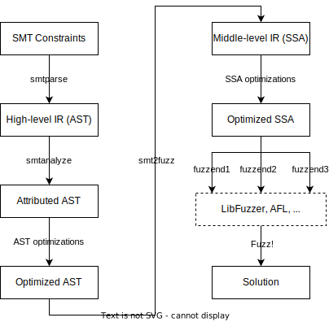
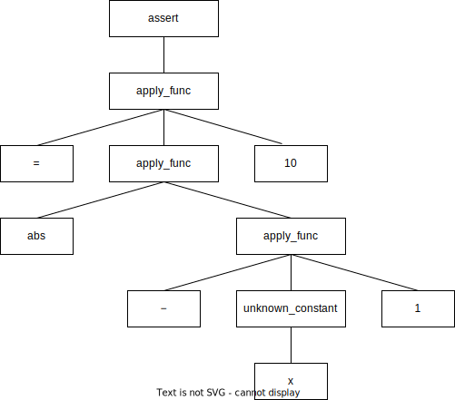

# krpk

krpk /ˈkrɪpki/ is a fuzzing-based SMT solver that can solve close-box functions and several other types of constraints that are challenging for traditional solvers. The name is in memory of [Professor Saul A. Kripke](https://en.wikipedia.org/wiki/Saul_Kripke), a renowned logician and philosopher.

## Design

Fuzzing-based SMT solving is a technique that converts a constraint into a specifically constructed program and then uses a fuzzer to check the reachability of certain code snippets in that program. These code snippets are only reachable if and only if the constraint is satisfiable and the inputs that reach them are, in essence, solutions to the original constraint.

For example, the satisfiability of the following SMT constraint

```smtlib2
(assert (= (abs (- x 1))) 10)
```

is equivalent to the reachability of the `abort` statement at line 5 in the following C++ code snippet.

```c
int e1 = x - 1;
int e2 = abs(e1);
if (e2 == 10) {
    fprintf(stderr, "sat\n");
    abort();
}
fprintf(stderr, "unsat\n");
return 0;
```

Our krpk is a tool that implements such a transform-and-fuzz solving strategy for SMT constraints.

### Overview



The whole transform-and-fuzz process is divided into three stages, as shown in the figure above:

1. Parse the SMT constraints into an AST-like high-level IR with `smtparser`, and perform semantic analysis and AST-level optimizations on it with `smtanalyze`.

2. Transform the high-level IR into a SSA-form middle-level IR with `smt2fuzz`, and apply SSA-level optimizations on it.

3. Compile the SSA-form middle-level IR into a C++ program with `fuzzend`, and fuzz it with a specific fuzzer.

We proceed to explain each stage in detail.

### High-level IR, `smtparser`, and `smtanalyzer`

The high-level IR (HIR) is an AST that describes the syntactic structure of an SMT constraint accurately. For example, the HIR of the previous constraint `(assert (= (abs (- x 1))) 10)` is shown below:



We use `smtparser` to parse text-form SMT constraints into HIR, and `smtanalyzer` to perform semantic analyses and optimizations on it. These analyses and optimizations gather the necessary semantic information and/or simplify the tree structure. Currently, there are three types of analyses/optimizations at this stage:

1. Sort analysis: Perform sort analysis on each term in the constraint and assign it a sort (e.g. `Bool` or `(_ BitVec 32)`). For example, `(abs (- x 1))` has the sort `Int` and `(= (abs (- x 1))) 10)` has the sort `Bool`.

2. Constant reduction: Reduce statically computable constant expressions, which are terms like `(concat <constant_bv1> <constant_bv2>)`. For example, `(= (concat #x08 #x08) y)` is reduced to `(= #x0808 y)`.

3. Array index bound analysis: Analyze the upper bound of each array’s indices by finding the maximum value that `<constant_idx>` can have in any term like `(select <array> <constant_idx>)`. Note that `<constant_idx>` can be ones that are computed in the constant reduction step. For example, if the constraints contain `(select a #x00000001)`, `(select a #x00000002)`, and `(select a #x00000005)`, then the upper bound of `a`’s indices is `#x00000005`.

We need to infer the upper bounds of the array indices because, although arrays in SMT-LIB ArraysEx Theory can be (theoretically) infinite, we need to allocate limited memory for them in the generated program, where a maximum possible size must be known.

We use a system of analysis-and-optimization plugins similar to LLVM’s compilation pass system, which supports flexible swapping in case we need more or different analyses/optimizations in the future.

### Middle-level IR and `smt2fuzz`

We then transform the AST-like HIR into an SSA-form middle-level IR (MIR) that has a linear structure closer to the final program to be fuzzed. This makes it easier to compile SMT constraints into programs written in common programming languages. Also, some optimizations are more convenient to perform on the linear-form MIR than on the tree-like HIR.

The transformation performed by `smt2fuzz` is straightforward since there are no branches in MIR. We only need to use SSA expressions to compute the boolean value to assert (e.g., the value of `x == 10` for the constraint `(assert (= x 10))`) and then check it. A more complicated example is the previous one that involves `abs`.

```smtlib2
(assert (= (abs (- x 1))) 10)
```

It is transformed to the MIR code as follows:

```text
%1 = isub %x 1
%2 = callcb abs %1
%3 = ieq %2 10
check %3
```

Some optimizations are easier to apply on MIR. One is the equivalence class optimization: as suggested in [this paper](https://dl.acm.org/doi/10.1145/3293882.3330554), when a constraint involves an equality check between a free variable and a close-box function invocation, e.g., `(= z (abs x))` where `z` is a free variable and `abs` is a close-box function, we should make `z` an alias to `(abs x)` instead of an unknown to solve, or otherwise it will take too much time for the fuzzer to find a suitable value for `x`. This requires us to translate the `=` function to an assignment instead of a normal comparison, i.e.,

```
(assert (and (= z (abs x)) (= z 10)))
```

should be translated to
```text
%z = callcb %x
%1 = ieq %z 10
check %1
```

instead of

```text
%1 = callcb %x
%2 = ieq %1 %z
%3 = ieq %z 10
%4 = and %2 %3
check %4
```

This is hard in HIR since there is no concept of assignment in the language (for it is declarative), but easy and straightforward in MIR (for it is imperative).

*We have yet to actually enable the equivalence class optimizations due to bugs. It will soon be ready for deployment. Also, we are exploring more possible optimizations on MIR.*

Also, these optimizations-on-MIR are implemented in a plugin system akin to LLVM's compilation pass system.

Another advantage that MIR gives us is that it separates the front end and middle end from the back end and enables us to readily try different fuzzers as the back end. We will discuss this in the next section.

### Fuzz-program and `fuzzend`

Eventually, MIR is translated into actual programming languages and fed to fuzzers to find a solution. We achieve this by using `fuzzend`s. Thanks to the separation of the front end/middle end from the back end brought by MIR, we can readily support different fuzzers no matter what language they are written in (C/C++, python, etc.) by implementing multiple `fuzzend`s and re-using all other components (`smtparser`, `smtanalyze`, `smt2fuzz`). We have supported LibFuzzer as the `fuzzend` and may introduce more fuzzers if necessary.

### Extensibility

As mentioned before, our system has marvelous extensibility. This comes from the plugin systems we use for HIT/MIR analyses/optimizations and the separation of the front end/middle end from the back end by MIR and `fuzzend`s. Also, we don’t rely on the data structures of any existing SMT libraries, so we can directly support new language constructs that are not in the standard by modifying our parser, analyzer, and other modules.

## License

This project uses open-source software with licenses listed below:

- [smt2](https://github.com/regular-pv/smt2): [LICENSES/smt2.LICENSE](LICENSES/smt2.LICENSE)
- [match-template](https://github.com/tikv/match-template): [LICENSE/match-template.LICENSE](LICENSE/match-template.LICENSE)
